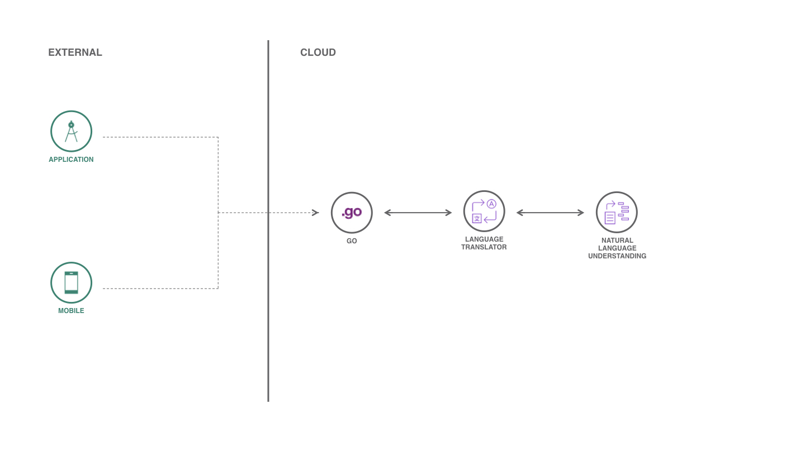

# Buweets

Buweets is an easy way to learn how to programming new APIs and services and connect to Watson APIs. This repository is initially for people who need to understand the data flow to translate a text and then send it to a natural language processing service. Here you find an API that connects your Android and iOS application to a service that analyzes and extracts emotions and sentiment from a text.

## Components and technologies

* [Cloud Foundry (Go Runtime)](https://cloud.ibm.com/cloudfoundry/overview): Cloud Foundry is an open-source platform as a service (PaaS) that provides you with a choice of clouds, developer frameworks, and application services.
* [Golang](https://golang.org): Go is an open source programming language that makes it easy to build simple, reliable, and efficient software.
* [Language Translator](https://cloud.ibm.com/catalog/services/language-translator): Neural Machine Translation comes standard for each language pair. Instantly translate your content into multiple languages. From translating documents, apps, and websites to creating multilingual chatbots.
* [Natural Language Understanding](https://cloud.ibm.com/catalog/services/natural-language-understanding): Use advanced NLP to analyze text and extract meta-data from content such as concepts, entities, keywords, categories, sentiment, emotion, relations, and semantic roles.

## LICENSE

Copyright 2019 Victor Shinya

Licensed under the Apache License, Version 2.0 (the "License");
you may not use this file except in compliance with the License.
You may obtain a copy of the License at

    http://www.apache.org/licenses/LICENSE-2.0

Unless required by applicable law or agreed to in writing, software
distributed under the License is distributed on an "AS IS" BASIS,
WITHOUT WARRANTIES OR CONDITIONS OF ANY KIND, either express or implied.
See the License for the specific language governing permissions and
limitations under the License.
